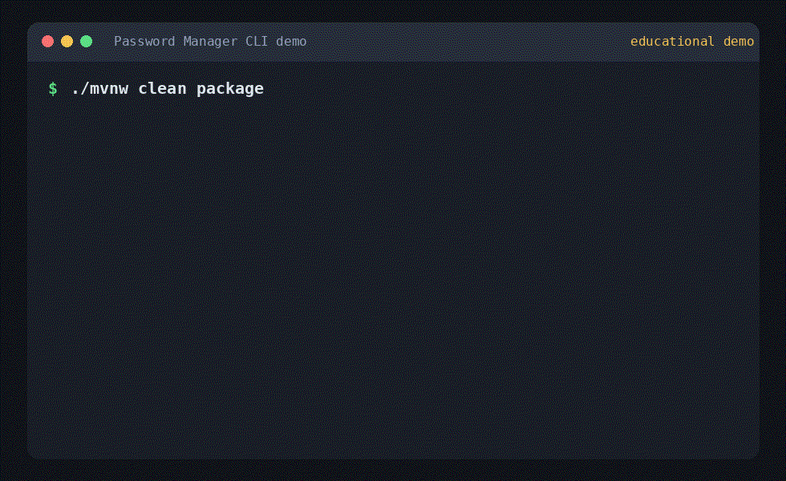

# Password Manager CLI

Edukacyjny lokalny zaszyfrowany vault haseł zbudowany w Javie 21. Projekt jest przygotowany pod portfolio: pokazuje warstwową architekturę, szyfrowanie uwierzytelnione, KDF, atomowy zapis plików i testowalne flow komend CLI.

> To projekt edukacyjny bez profesjonalnego audytu bezpieczeństwa. Nie jest zamiennikiem produkcyjnych menedżerów haseł. Używasz go na własną odpowiedzialność.

## Funkcje

- Lokalny zaszyfrowany vault JSON w `~/.passwordmanager/vault.json`.
- AES-256-GCM dla zaszyfrowanego payloadu vaulta.
- Argon2id do wyprowadzania klucza z hasła master.
- Dodawanie, listowanie, pokazywanie, aktualizacja i usuwanie wpisów.
- Generator haseł z konfigurowalną długością i klasami znaków.
- Eksport/import jawnego JSON do backupu albo migracji.
- Atomowy zapis vaulta i kopia `.bak` przed aktualizacją.
- Maven, JUnit, GitHub Actions, fat jar i skrypty uruchomieniowe.

## Szybki Start

Wymagania:

- Java 21 lub nowsza
- Maven jest opcjonalny, bo repozytorium zawiera Maven Wrapper

Budowanie i uruchomienie z katalogu projektu:

```bash
./mvnw clean package
./passwordmanager.sh --help
```

### Dodanie launchera do PATH

Launchery zakładają, że projekt został wcześniej zbudowany przez `./mvnw clean package`.

Linux:

```bash
mkdir -p ~/.local/bin
ln -sf "$(pwd)/passwordmanager.sh" ~/.local/bin/passwordmanager
```

Jeśli `~/.local/bin` nie jest w `PATH`, dodaj do `~/.bashrc` albo `~/.zshrc`:

```bash
export PATH="$HOME/.local/bin:$PATH"
```

macOS:

```bash
sudo ln -sf "$(pwd)/passwordmanager.sh" /usr/local/bin/passwordmanager
```

Windows PowerShell:

```powershell
$project = (Get-Location).Path
[Environment]::SetEnvironmentVariable(
  "Path",
  [Environment]::GetEnvironmentVariable("Path", "User") + ";$project",
  "User"
)
```

Po otwarciu nowego terminala Windows uruchomi `passwordmanager` przez `passwordmanager.bat`.

Pełniejsze instrukcje są w [docs/installation.md](docs/installation.md).

## Demo



Flow do skopiowania:

```bash
./mvnw clean package
./passwordmanager.sh init
./passwordmanager.sh add --name github --username user@example.com --url https://github.com
./passwordmanager.sh list
./passwordmanager.sh show --name github
./passwordmanager.sh update --name github --prompt-password
./passwordmanager.sh export --output backup.json
```

Inicjalizacja vaulta:

```bash
./passwordmanager.sh init
```

Dodanie wpisu. Jeśli pominiesz `--password`, aplikacja zapyta o hasło wpisu bez wyświetlania go w terminalu:

```bash
./passwordmanager.sh add --name github --username user@example.com --url https://github.com
```

Dodanie wpisu z wygenerowanym hasłem:

```bash
./passwordmanager.sh add --name email --username user@example.com --generate --length 24
```

Listowanie i podgląd wpisu:

```bash
./passwordmanager.sh list
./passwordmanager.sh show --name github
```

Aktualizacja wpisu z promptem na nowe hasło:

```bash
./passwordmanager.sh update --name github --prompt-password
```

Eksport/import jawnego JSON:

```bash
./passwordmanager.sh export --output backup.json
./passwordmanager.sh import --input backup.json
```

Pliki eksportu są jawne i zawierają hasła. Traktuj je jak dane wrażliwe.

## Komendy

| Komenda | Opis |
| :--- | :--- |
| `init` | Inicjalizuje nowy zaszyfrowany vault. |
| `add` | Dodaje wpis. Domyślnie pyta o hasło wpisu, chyba że użyjesz `--password` albo `--generate`. |
| `list` | Listuje nazwy, użytkowników i URL-e bez pokazywania haseł. |
| `show` | Pokazuje pełne dane jednego wpisu, razem z hasłem. |
| `update` | Aktualizuje pola albo rotuje hasło przez `--generate` lub `--prompt-password`. |
| `remove` | Usuwa wpis po nazwie. |
| `export` | Eksportuje wpisy do jawnego JSON. |
| `import` | Scala wpisy z jawnego JSON, pomijając duplikaty po ID. |
| `generate` | Generuje samodzielne losowe hasło. |

## Bezpieczeństwo

- Hasło master jest czytane jako `char[]` i czyszczone po użyciu tam, gdzie pozwalają na to API Javy.
- Hasło wpisu można podać przez bezpieczniejszy prompt bez echo. Opcja `--password` nadal istnieje dla skryptów, ale może ujawnić hasło w historii shella albo liście procesów.
- Koperta vaulta jest walidowana przed KDF: format, wersja, Base64, długości soli/nonce oraz limity parametrów Argon2.
- AES-GCM AAD uwierzytelnia wybrane pola nagłówka: format, wersję, nazwę KDF, nazwę szyfru i długość tagu.
- Parametry KDF, sól i nonce są jawne, bo są potrzebne do odszyfrowania. Dane wpisów są tylko w zaszyfrowanym payloadzie.
- Lokalny CLI nie chroni przed malware, keyloggerami, screen capture ani uprzywilejowanym atakującym na tym samym komputerze.
- To projekt edukacyjny używany na własną odpowiedzialność.

## Development

Testy:

```bash
./mvnw test
```

Fat jar:

```bash
./mvnw clean package
java -jar target/passwordmanager-0.1.0-SNAPSHOT.jar --help
```

## Stack

- Java 21
- Maven
- Maven Wrapper
- picocli
- Jackson
- Bouncy Castle Argon2id
- Java Cryptography Architecture AES-GCM
- JUnit 5

## Licencja

MIT. Szczegóły w [LICENSE](LICENSE).
